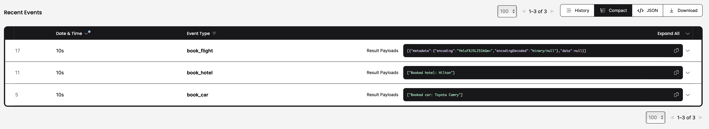
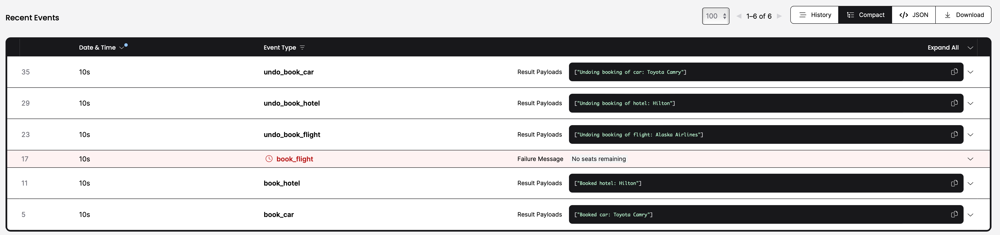
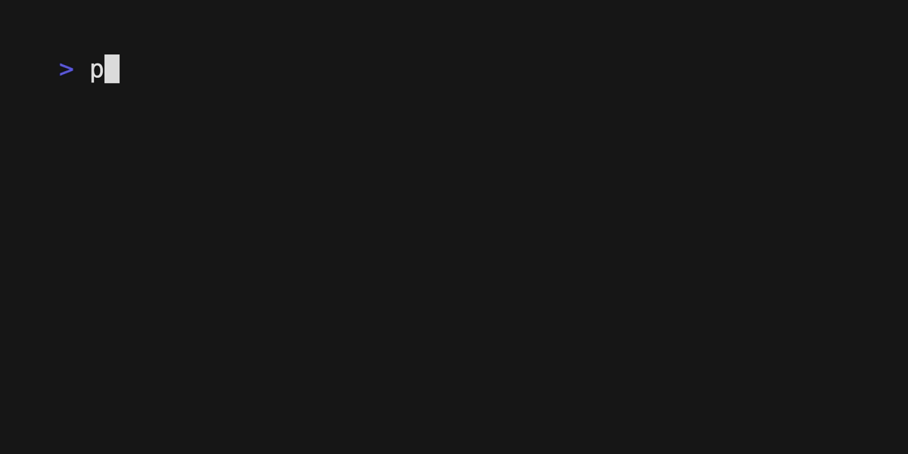

# Sagas

Sagas are a protocol for implementing long-running processes. The Saga protocol ensures that a process is atomic, that is, a process executes observably equivalent to completely or not at all.

## Overview

The booking saga workflow is responsible for coordinating the booking of a vacation package, consisting of a car, hotel, and flight reservation. In the event of a failure at any point during the booking process, the workflow will trigger compensating actions to undo any previous bookings.


## Running

Prerequisites:

- Python >= 3.7
- [Poetry](https://python-poetry.org)
- [Local Temporal server running](https://docs.temporal.io/application-development/foundations#run-a-development-cluster)

With this repository cloned, run the following at the root of the directory:

```bash
poetry install
```
That loads all required dependencies.

Then run the worker and workflow.

```bash
poetry run python run_worker.py
poetry run python run_workflow.py
```







### Demo: Happy Path
Enter your booking information in the Flask app <http://127.0.0.1:5000>, then see the tasks in the Web UI at <http://localhost:8233/>.

Select your running or completed Workflow ID.

Under **WorkflowExecutionCompleted** car, hotel and flight are booked.

Notice each is executed via an activity.

### Demo: Recover Forward (retries)

Modify `Attempts = 1` to `Attempts = 3` in UI, so that the booking activities attempt a retry 3 times.
Render your booking information in the Flask app <http://127.0.0.1:5000>, then see the tasks in the Web UI at <http://localhost:8233/>.

Select your running or completed Workflow ID.

Under **Recent** events, select the failed Activity, `book_flight` (in compact view).

Under **ActivityTaskStarted** you'll see the Attempts (3), and the stack trace message letting you know the last failed attempt.

Then notice how the Workflow executes the compensations.

### Demo: Recover Backward (rollback)

Modify `Flight = Alaska Airlines 123` to `Flight = invalid` in the UI, so that the `book_flight` Activity fails and a rollback occurs. 
Render your booking information in the Flask app <http://127.0.0.1:5000>, then see the tasks in the Web UI at <http://localhost:8233/>.

Select your running or completed Workflow ID.

Under **Recent** events, select the failed Activity, `book_flight` (in compact view).

Under **ActivityTaskStarted** you'll see the Attempts (5), and the stack trace message letting you know the last failed attempt.

Under **ActivityTaskFailed** you'll see error `Invalid flight booking, rolling back!`. You will also see that since the booking cannot be completed, rollback (undo) is performed using compensation.

## Design

The booking saga is implemented using the Temporal Workflow framework, which provides a robust and fault-tolerant platform for coordinating distributed transactions.

The saga workflow consists of three activities: `book_car()`, `book_hotel)()`, and `book_flight)()`, each of which is responsible for making a reservation with the corresponding service provider. If any of these activities fail, the workflow will trigger the corresponding compensating action (`undo_book_car()`, `undo_book_hotel()`, or `undo_book_flight()`) to undo any previous bookings.

The `non_retryable_error_types` parameter is used to specify a list of error types that should not be retried when a Workflow or Activity fails.
